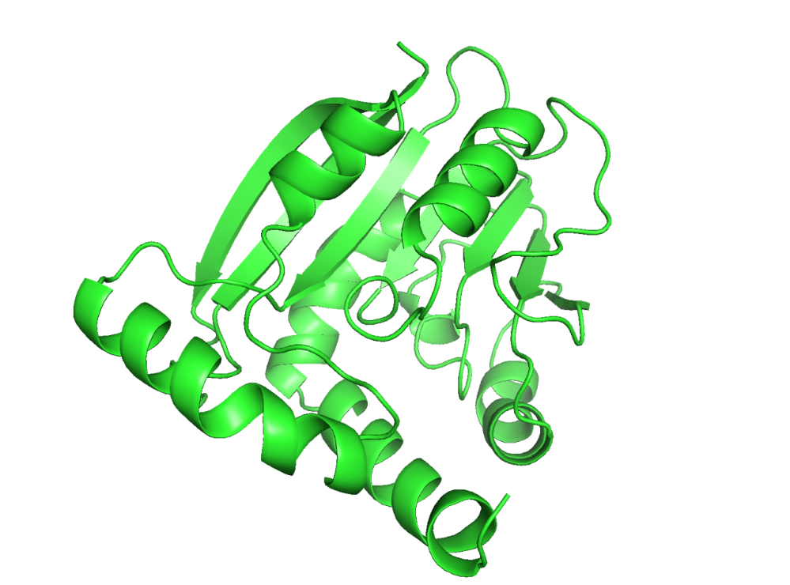
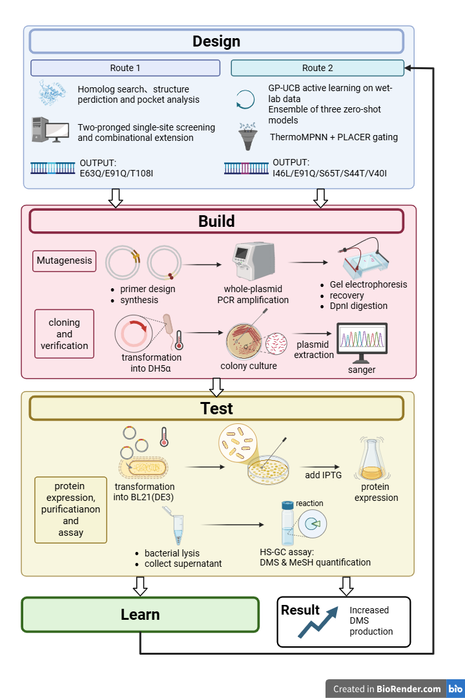
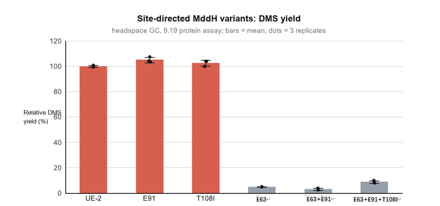
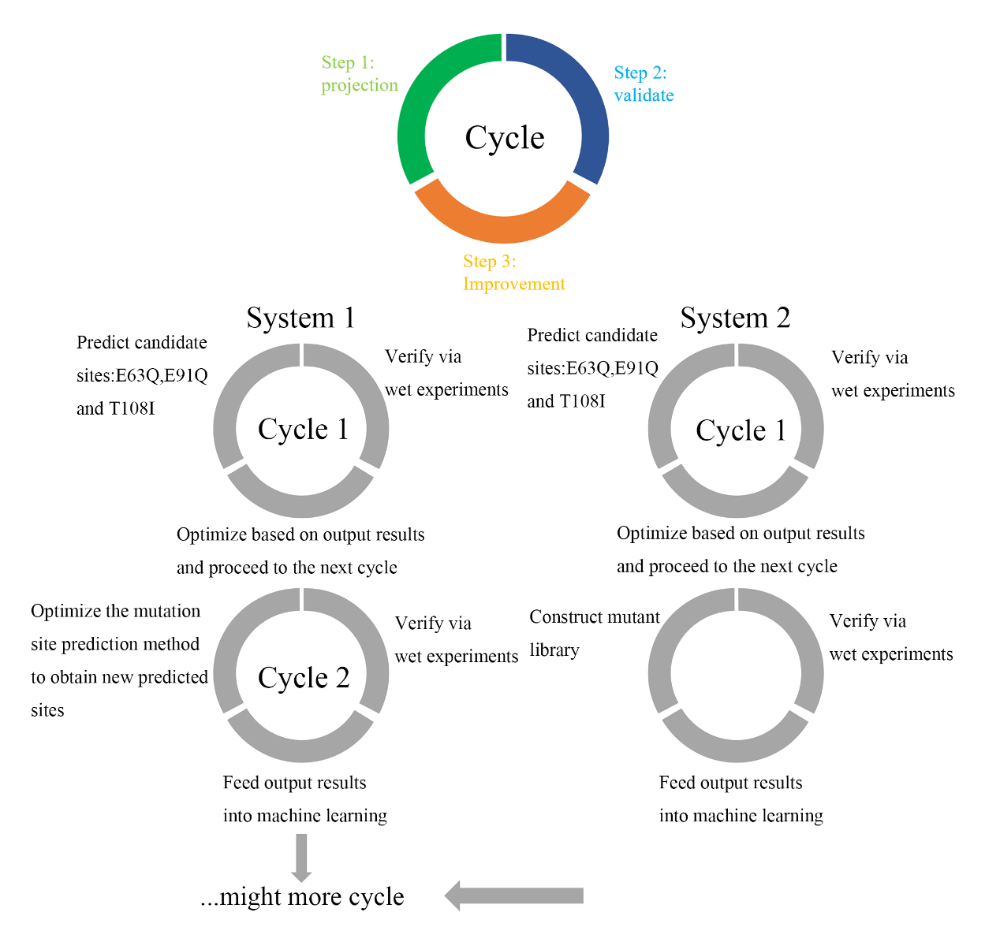

# Project · IDEC Wiki

============ Page Header ============

Project

# Strengthening MddH: From Semi‑Rational Design to DBTL Closed Loop

This project converts inorganic sulfur pollutant H₂S into organic sulfur platform molecule DMS. We engineer the marine microbial SAM‑dependent methyltransferase
**MddH**
. Key residues are identified via homologous sequence alignment and molecular docking. Single and combinatorial mutants are constructed, and activity is characterized using headspace gas chromatography. This page contains five sections:
**Description · Design · Results · Supplement · Protocol**
.

============ Main Content: Side Navigation + Five Sections ============
01 Description
02 Design
03 Results
04 Supplement
05 Protocol
---------------- 01 Description ----------------
01

## Description · Background, Mechanism & Objectives

### Background: Converting Sulfur from Waste Gas into Platform Molecules

**Hydrogen sulfide (H₂S)**
is a toxic inorganic sulfur pollutant massively released during industrial manufacturing. Bioconversion of waste‑gas derived H₂S into
**dimethyl sulfide (DMS)**
represents a promising route for sulfur resource recovery: DMS acts as a
**platform intermediate**
linking inorganic sulfur to diverse organosulfur chemicals. Downstream, it can be oxidized to dimethyl sulfoxide (DMSO), and also serve as a methyl/sulfur donor precursor for biosynthesis of methionine and sulfur‑containing fine chemicals.

Nevertheless, wild‑type MddH has two bottlenecks: low affinity toward
**gaseous H₂S**
, and severe
**substrate inhibition**
under high sulfide concentrations, limiting its application in the "inorganic sulfur → organic sulfur" conversion.

Mechanism

### Two Successive Methylations Catalyzed by MddH

MddH is a SAM‑dependent methyltransferase derived from
**marine microorganisms**
. It catalyzes two sequential reactions: inorganic H₂S is first methylated to
**methanethiol (MeSH)**
, and methanethiol is further methylated into
**DMS**
. Both steps use
**SAM (S‑adenosylmethionine)**
as the methyl donor, with SAH as the byproduct.

H₂S + SAM → MeSH + SAH

MeSH + SAM → DMS + SAH

The reference sequence used in this project originates from
*Marinobacter litoralis*
SW-45 (referred to as
**UE2**
). This protein shares relatively high similarity with human TMT1A / TMT1B (especially the central and C‑terminal regions), containing a conserved central
**GxGxG**
motif and one glutamate residue within the SAM binding pocket (the human homolog has aspartate at this position).

The bottleneck

### Two Limitations of Wild‑Type Enzyme

- Low affinity toward gaseous H₂S
- Severe substrate inhibition at high sulfide concentration

This serves as the starting point for all subsequent design work.

Strategy

### Semi‑Rational Design + Dry‑Wet Closed Loop

Semi‑rational protein engineering breaks intrinsic enzyme bottlenecks without large‑scale random mutagenesis screening. We first identify conserved functional regions via homologous sequence alignment, then construct the
**MddH–SAM–H₂S ternary complex model**
using molecular docking to directly pinpoint key residues inside the substrate binding pocket; molecular dynamics simulations are subsequently used to validate binding conformations, and YASARA virtual mutagenesis calculates folding free energy changes (ΔΔG) to discard substitutions that disrupt protein structure.

Hypothesis (Route A)

### Working Hypothesis for Round 1

UE2 exhibits overly strong SAM binding (estimated −7.9 kcal/mol from early docking). We therefore hypothesize:
**moderately weakened cofactor binding accelerates catalytic turnover and improves DMS yield**
. Based on this, affinity ranking via Boltz‑2 selected three sites:
**E63Q, E91Q, T108I**
. Single, double and triple combinatorial mutants were constructed for wet‑lab validation.

---------------- 02 Design ----------------
02

## Design · Engineering Strategy

Why not random mutagenesis? DMS yield requires gas chromatography quantification, which is costly and time‑intensive for high‑throughput screening; for this protein, only AlphaFold predicted structures were available at the beginning, and initial computational predictions may be inaccurate. Thus, this project adopts a combined workflow:
**computational predictions guide wet experiments, and wet results in turn refine computational models**
, forming two independent yet complementary cyclic systems.

Vertical flowchart: place image under assets/img/project/design-flow.png

Vertical flowchart
`assets/img/project/design-flow.png`

Figure · Design workflow

### Design Workflow

Full pipeline from homology alignment and molecular docking to Route A / Route B consensus scoring and next‑generation candidate selection.

| Variant | ΔΔG (kcal/mol) | Interpretation |
|---|---|---|
| UE2 (Wild type) | — | Control |
| E63Q | 0.79 | Mild destabilization |
| E91Q | 0.82 | Mild destabilization |
| T108I | 0.098 | Nearly neutral |
| E63Q/E91Q | 1.66 | Destabilized (approximately additive) |
| E63Q/E91Q/T108I | 1.53 | Destabilized (weak epistatic compensation from T108I) |

#### Route A: Single-metric Affinity Prediction

AlphaFold3 predicts the apo homotetramer structure of UE2; molecular docking builds the MddH–SAM–H₂S ternary complex. Boltz‑2 ranks point mutants by binding affinity to select E63Q, E91Q, T108I.

Round 1 Design · Completed

#### Wet-Lab Validation (Round 1)

Five variants were constructed and expressed in
*E. coli*
. Crude enzyme lysates catalyzed H₂S methylation, and HS-GC quantified DMS. E91Q and T108I exhibited modest activity improvement; E63Q nearly lost activity.

Wet Lab · Completed

#### Feedback: Single Metric Is Insufficient

Round 1 prediction relied solely on binding affinity without kinetic evidence (e.g. Km) for SAM binding. Therefore, predictions did not fully translate into activity gains. These results feed into the refined module to launch the next iteration.

Learn · Completed

#### Route B: Multi-dimensional Consensus Strategy

Three pre-trained models with distinct mechanisms (
**ProtSSN, ProSST, TranceptEVE**
) are combined with
**PLACER**
ligand conformational ensemble analysis, plus
**ThermoMPNN stability cutoff**
(ΔΔG > +1 kcal/mol rejected directly) and sequence sanity checks to avoid residue numbering errors. Instead of only binding affinity, protein stability and the actual spatial conformation of SAM inside the pocket are considered simultaneously.

Round 2 Design · Completed

#### Semi-Rational Mutant Library: Pocket Saturation Scanning

Within an 8 Å radius around residues with mild activity improvement in Round 1,
**45 residues**
were selected for saturation scanning, computationally generating
**855 single-point mutant candidates**
. Compared with conventional random mutagenesis, this library is smaller, reducing wet-lab workload and improving efficiency.

System 2 · Computationally finished, physical library not yet built

#### Priority Candidate List for Next-Round Validation

Ranked by consensus score, high-priority candidates for near-term validation include
**I46L, S65T, S44T, V40I**
, plus
**E91A/D/N**
variants for mechanistic investigation.

Next Step · In Progress

System 1

### Refine Computational Prediction

Iteratively update predictive models with wet-lab data: replace single-metric scoring, add stability cutoffs and ligand conformational gating, and apply sequence validation to prevent numbering errors for more reliable recommendations in subsequent rounds.

System 2

### Construct Semi-Rational Mutant Library

Perform pocket saturation scanning around predicted residues to generate a controllable candidate library; outputs feed back into System 1 to support iterative optimization.

---------------- 03 Results ----------------
03

## Results · Experimental Outcomes

Setup

### Expression, Catalysis and Quantification

Five variants (E63Q, E91Q, T108I, E63Q/E91Q, E63Q/E91Q/T108I) were synthesized by Sangon Biotech (Shanghai) Co., Ltd. After sequence verification, all were expressed in
*E. coli*
. Crude enzyme lysates catalyzed H₂S methylation under identical conditions, and product DMS was quantified by
**headspace gas chromatography**
. Calibration curve: √Peak Area = 3.1854C − 25.261.

| Strain / Variant | DMS (nmol) | Relative Yield (%) | CV (%) | vs Wild Type (Dunnett) |
|---|---|---|---|---|
| UE-2 (Wild type) | 336.4 ± 2.6 | 100 | 0.8 | — |
| **E91Q** | 353.5 ± 7.3 | **105.1** | 2.1 | P = 0.0045 (**) |
| T108I | 344.7 ± 7.9 | 102.5 | 2.3 | P = 0.199 (ns) |
| E63Q | 16.4 ± 0.4 | 4.9 | 2.3 | P < 0.0001 (****) |
| E63Q/E91Q | 10.1 ± 2.7 | 3.0 | 26.9 | P < 0.0001 (****) |
| E63Q/E91Q/T108I | 29.2 ± 3.8 | 8.7 | 13.1 | P < 0.0001 (****) |

Statistics

### Statistical Tests

One‑way ANOVA revealed highly significant differences among the six groups:
**F(5,12) = 3979.5, P < 0.0001**
.

Dunnett’s multiple comparison (against wild type): E91Q was significantly higher (+17.1 nmol, adjusted P = 0.0045); T108I showed no significant difference (+8.3 nmol, P = 0.199); All three E63Q‑containing variants were highly significantly lower (−320.0, −326.2, −307.2 nmol relative to wild type, adjusted P < 0.0001).

Reproducibility

### Reproducibility: Are Data Reliable?

CV values for samples with measurable activity were 0.8% (WT), 2.1% (E91Q), 2.3% (T108I), 2.3% (E63Q), demonstrating a stable and reliable crude lysate assay system.

The two combinatorial variants carrying E63Q exhibited elevated CV (26.9%, 13.1%), because yields approached the detection limit; however, their maximum replicate values were only 3.9% and 10.0% of wild type, so the conclusion of severe activity loss remains robust.

Whole‑cell batch reproducibility was substantially poorer (WT CV up to 90.6%, nearly 20‑fold fluctuation with suspected single‑point recording anomalies). Quantitative conclusions of this study are therefore based on crude lysate data, and whole‑cell data are only used for qualitative judgment. Initial‑rate kinetic assays will be adopted next to improve data quality.

Product profile

### Product Difference in E63Q Variants: Blocked at the Second Step

MeSH and DMS were quantified simultaneously within the same batch of experiments: DMS peak areas for wild type, E91Q and T108I were 2.28×10⁷, 2.02×10⁷, 1.95×10⁷ respectively, whereas
**no detectable DMS peak**
was observed for E63Q, E63Q/E91Q and triple mutant; yet these variants still produced MeSH comparable to wild type (1.38×10⁷, 1.67×10⁷, 1.65×10⁷ vs WT 1.63×10⁷).

This preliminarily suggests that E63Q‑containing variants
**largely retain first‑step methylation activity, while the second step (MeSH → DMS) is severely impaired**
. This does not necessarily mean E63 directly catalyzes the second step; the mutation may indirectly affect catalysis via local conformational rearrangement. In addition, MeSH peaks in no‑enzyme controls were also high (1.24–1.77×10⁷), indicating substantial background interference. More stringent controls (e.g. heat‑inactivated enzyme, SAM omission) are required for accurate MeSH quantification.

Figure 1
`assets/img/results/figure-01.png`

Figure 1

### AlphaFold Structure Prediction

3D structural model of UE2 (MddH).

Figure 2
`assets/img/results/figure-02.png`

Figure 2

### Two Cyclic Systems

Refined computational prediction and semi‑rational mutant library construction.

Figure 3
`assets/img/results/figure-03.png`

Figure 3

### DMS Yield Comparison

Relative DMS yield of each variant normalized to wild type (n = 3).

Figure 4
`assets/img/results/figure-04.png`

Figure 4

### DBTL Workflow

Overall pipeline for Route 1 (Validated) and Route 2 (In Progress).

Conclusion

### Conclusions

1. Among the three residues selected via homology alignment and molecular docking, **E91Q significantly improved DMS yield by approximately 5%** , and T108I maintained activity close to wild type.
2. **E63 is indispensable for catalysis** : its mutation reduced activity below 10% of wild type, with impairment localized to the second methylation step (MeSH → DMS).
3. **Simple additive mutagenesis brings no benefit** : both combinatorial variants showed activity lower than wild type, indicating these sites do not act independently with additive effects.
4. Subsequent engineering should focus on **E91 and its interaction network** , while E63 is better suited as a target for mechanistic investigation.

---------------- 04 Supplement ----------------
04

## Supplement · Supplementary Materials

### Glossary

| Abbreviation | Full Name | Definition |
|---|---|---|
| MddH | SAM-dependent methyltransferase | Marine microbial enzyme catalyzing two-step methylation: H₂S → MeSH → DMS |
| UE2 | — | Wild-type reference sequence from *Marinobacter litoralis* SW-45 |
| H₂S | Hydrogen sulfide | Toxic inorganic sulfur substrate from waste gas |
| MeSH | Methanethiol | Product of first step; substrate for second methylation |
| DMS | Dimethyl sulfide | Organosulfur platform molecule |
| DMSO | Dimethyl sulfoxide | Downstream oxidation product of DMS |
| Tmm | Monooxygenase | Enzyme for future cascade: DMS → DMSO |
| SAM / SAH | S-adenosyl methionine / S-adenosyl homocysteine | Methyl donor and its byproduct |
| ΔΔG | Folding free-energy change | Positive value = mutation destabilizes protein (FoldX / ThermoMPNN calculation) |
| HS-GC | Headspace gas chromatography | Detection method for MeSH and DMS quantification in this project |
| CV | Coefficient of variation | Index describing data dispersion among replicates |
| DBTL | Design–Build–Test–Learn | Iterative closed-loop framework adopted in this project |
| Boltz-2 / PLACER | — | Binding affinity / ligand conformation prediction tools, modules for Route A & Route B |
| ProtSSN / ProSST / TranceptEVE | — | Zero-shot fitness prediction models used for Route B consensus scoring |

Materials

### Strains, Vectors and Reagents

- Expression host: *Escherichia coli* BL21(DE3) (provided by supervisor’s lab)
- Vector: pET28, kanamycin resistance, screening concentration 50 μg/mL
- LB medium: Tryptone 10 g, NaCl 10 g, yeast extract 5 g / L; add 15 g/L agar for solid plates
- High-fidelity polymerase: GXL DNA polymerase (for site-directed mutagenesis PCR)
- Instrument: Agilent 8860B gas chromatograph with headspace autosampler (N₂ carrier gas)
- Statistics & plotting: GraphPad Prism

Safety & ethics

### Safety & Ethics

- **H₂S is highly toxic and flammable:** All manipulations were performed in fume hoods to prevent gas accumulation; avoid arbitrary H₂S release under strongly acidic conditions
- **Methanethiol (MeSH)** is highly volatile with strong odor; vial opening and sampling done inside fume hood
- **SAM** reagent is prone to degradation: store at −20 ℃ protected from light, handle on ice, avoid repeated freeze-thaw cycles
- **Kanamycin** and resistant strains must be inactivated properly before disposal; do not discharge directly
- Organosulfur waste liquid collected separately; *E. coli* BL21(DE3) handled under Biosafety Level 1 conditions

### References

- [1] Krieger, E., Koraimann, G., & Vriend, G. (2002). Increasing the precision of comparative models with YASARA NOVA—a self-parameterizing force field. Proteins: Structure, Function, and Bioinformatics, 47(4), 393–402. DOI: https://doi.org/10.1002/prot.10134
- [2] Delgado, J., Radusky, L. G., Cianferoni, D., et al. (2019). FoldX 5.0: working with RNA, small molecules and a new graphical interface. Bioinformatics, 35(20), 4168–4169. DOI: https://doi.org/10.1093/bioinformatics/btz325
- [3] Van Durme, J., Delgado, J., Stricher, F., et al. (2011). A graphical interface for the FoldX forcefield. Bioinformatics, 27(12), 1711–1712. DOI: https://doi.org/10.1093/bioinformatics/btr254
- [4] Guerois, R., Nielsen, J. E., & Serrano, L. (2002). Predicting changes in the stability of proteins and protein complexes: a study of more than 1000 mutations. Journal of Molecular Biology, 320(2), 369–387. DOI: https://doi.org/10.1016/S0022-2836(02)00442-4
- [5] Zhang, Y., Sun, C., Guo, Z., et al. (2024). An S-methyltransferase that produces the climate-active gas dimethylsulfide is widespread across diverse marine bacteria. Nature Microbiology, 9(10), 2614–2625. DOI: https://doi.org/10.1038/s41564-024-01788-6
- [6] Todd, J. D., Rogers, R., Li, Y. G., et al. (2007). Structural and regulatory genes required to make the gas dimethyl sulfide in bacteria. Science, 315(5812), 666–669. DOI: https://doi.org/10.1126/science.1135370
- [7] Lidbury, I., Kröber, E., Zhang, Z., et al. (2016). A mechanism for bacterial transformation of dimethylsulfide to dimethylsulfoxide: a missing link in the marine organic sulfur cycle. Environmental Microbiology, 18(8), 2754–2766. DOI: https://doi.org/10.1111/1462-2920.13354
- [8] Schäfer, H., Myronova, N., & Boden, R. (2010). Microbial degradation of dimethylsulphide and related C1-sulphur compounds: organisms and pathways controlling fluxes of sulphur in the biosphere. Journal of Experimental Botany, 61(2), 315–334. DOI: https://doi.org/10.1093/jxb/erp355
- [9] Meng, S., & Cui, H. (2025). From traditional to AI-driven: The evolution of intelligent enzyme engineering for biocatalysis. BioDesign Research, 7(3), 100044. DOI: https://doi.org/10.1016/j.bidere.2025.100044
- [10] Yang, J., Lal, R. G., Bowden, J. C., et al. (2025). Active learning-assisted directed evolution. Nature Communications, 16(1), 714. DOI: https://doi.org/10.1038/s41467-025-55987-8
- [11] Evans, R., O'Neill, M., Pritzel, A., et al. (2021). Protein complex prediction with AlphaFold-Multimer. bioRxiv. DOI: https://doi.org/10.1101/2021.10.04.463034
- [12] Bisswanger, H. (2014). Enzyme assays. Perspectives in Science, 1(1–6), 41–55. DOI: https://doi.org/10.1016/j.pisc.2014.02.005
- [13] Sheldon, R. A., & Woodley, J. M. (2018). Role of biocatalysis in sustainable chemistry. Chemical Reviews, 118(2), 801–838. DOI: https://doi.org/10.1021/acs.chemrev.7b00203
- [14] Giguère, S., Marchand, M., Laviolette, F., Drouin, A., & Corbeil, J. (2013). Learning a peptide-protein binding affinity predictor with kernel ridge regression. BMC Bioinformatics, 14, 82. DOI: https://doi.org/10.1186/1471-2105-14-82
- [15] Xu, Y., Verma, D., Sheridan, R. P., Liaw, A., Ma, J., Marshall, N. M., McIntosh, J., Sherer, E. C., Svetnik, V., & Johnston, J. M. (2020). Deep Dive into Machine Learning Models for Protein Engineering. Journal of Chemical Information and Modeling, 60(6), 2773–2790. DOI: https://doi.org/10.1021/acs.jcim.0c00073

### Appendix Files

Place attachments under
`assets/files/`
with filenames matching the links below for download. Dry-experiment codes and computational datasets will be publicly available on GitHub after upload.

[↓ Raw HS-GC Dataset](assets/files/idec-data.xlsx)
[↓ Project Report](assets/files/idec-report.pdf)
[↓ Computational Codes & Candidate Rankings](assets/files/idec-model.zip)
---------------- 05 Protocol ----------------
05

## Protocol · Experimental Procedures

The following workflow matches the Materials & Methods section of the manuscript and can be directly reproduced; key parameters are enclosed in parentheses.

#### Computational Design (Dry Lab)

AlphaFold3 prediction of apo UE2 homotetramer structure → molecular dynamics simulation to identify residues of interest → molecular docking to construct MddH–SAM–H₂S ternary complex → FoldX/YASARA ΔΔG calculation to filter unstable substitutions → ranking via Route B consensus scoring.

Computation · Batch-wise

#### Template DNA Extraction (Boil-Freeze Method)

Inoculate single colony into 5 mL LB medium supplemented with 50 μg/mL kanamycin, incubate at 37 ℃, 190 rpm until OD₆₀₀ ≈ 0.6. Take 200 μL bacterial culture, centrifuge at 12,000 rpm for 10 min and discard supernatant; resuspend pellet in 100 μL 1×TE buffer. Boil in water bath for 10 min → −20 ℃ for 30 min → incubate on ice for 30 min. Centrifuge at 12,000 ×g, 4 ℃ for 10 min; the supernatant is template DNA.

Template Preparation · ~1.5 h

#### Site-Directed Mutagenesis PCR (50 μL System)

Prepare reaction mixture according to the recipe on the right. Thermal profile: 94 ℃ for 5 min initial denaturation; 30 cycles (98 ℃ for 10 s denaturation → primer Tm for 15 s annealing → 68 ℃ for 1 min/kb extension); final extension at 68 ℃ for 10 min.

PCR · ~1.5 h

#### Agarose Gel Electrophoresis and Sequencing

1% agarose gel (small/medium/large gel: 0.17/0.34/0.68 g agarose in 17/34/68 mL TAE, gel dye 1.7/3.4/6.8 μL). Mix samples with 6× loading buffer, run electrophoresis at 150–155 V for 20–25 min. After validating target bands, submit samples for Sanger sequencing to confirm successful introduction of mutation sites.

Electrophoresis · ~1 h

#### Induced Expression

Inoculate seed culture into fresh LB medium, incubate at 37 ℃ for 2.5 h, then hold at 4 ℃ for 0.5 h. Add IPTG to a final concentration of
**0.1 mM**
, incubate at
**16 ℃ for 18 h**
for induction.

Expression · Overnight

#### Sonication for Crude Enzyme Preparation

Harvest cells by centrifugation at 8000 rpm, 4 ℃ for 10 min. Wash pellet with fresh LB and resuspend in 1 mL PBS. Sonicate on ice (5 s on / 10 s off, total 1 min, maximum 3 cycles). Centrifuge and collect supernatant as crude enzyme solution.

Cell Lysis · ~30 min

#### Catalytic Assay and HS-GC Detection

200 μL reaction system: crude enzyme + SAM (1 mM) + MeSH (1 mM). Incubate at 28 ℃ for 3 h. Centrifuge, transfer supernatant into headspace vial and seal. Detect via HS-GC (Agilent 8860B, N₂ carrier gas), integrate peak areas of DMS and MeSH.

Reaction + Detection · ~4 h

#### Data Conversion and Statistics

Convert absolute product yield (nmol) using calibration curve √PeakArea = 3.1854C − 25.261. Calculate relative activity with wild-type UE-2 set as 100%. Perform one-way ANOVA and Dunnett’s multiple comparison in GraphPad Prism (n = 3).

Data Analysis · Ongoing

#### Next Round: Initial-Rate Kinetics

Replace endpoint readings with standardized initial-rate kinetic assays to reduce batch-to-batch variation. Feed kinetic data back into the active learning module to recommend the next batch of 16–32 variants, closing the DBTL cycle.

In Progress

| Component | Volume |
|---|---|
| 5× GXL buffer | 10 μL |
| dNTP Mix | 4 μL |
| Forward Primer | 0.5 μL |
| Reverse Primer | 0.5 μL |
| GXL DNA polymerase | 1 μL |
| Plasmid Template | 1 μL |
| ddH₂O | 33.5 μL |
| **Total Volume** | **50 μL** |

**Completed and Ongoing Work**
Three single-site variants and combinatorial variants from Route A have been constructed and characterized. Route B consensus ranking and the saturation-scanning library of 855 candidates are computational outputs and the physical library has not yet been built. The priority candidate list for next-stage validation (I46L, E91Q, S65T, S44T, V40I and E91A/D/N) represents upcoming work.
